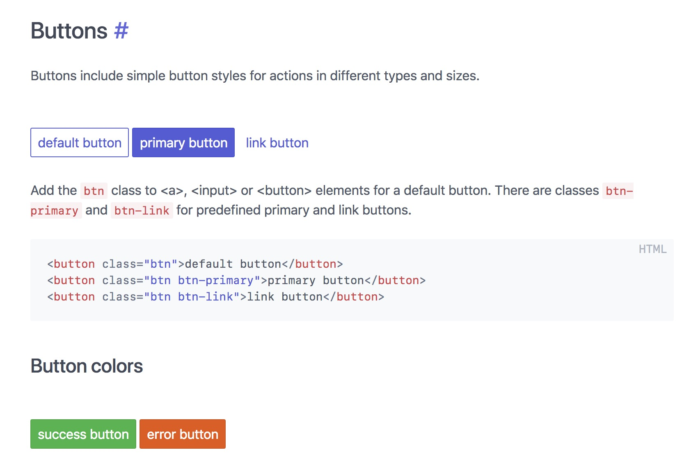
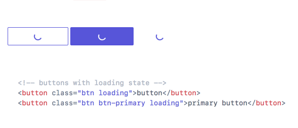

# 🕹 Create a Button component

👋 Hai!

We're starting to build out a form for our Potato App. One of the things we need are buttons!

## Task

We use [Spectre CSS](https://picturepan2.github.io/spectre/elements.html#buttons) for our CSS framework/design system. We'll need a React component that can do **all the things** the Spectre button can do.

On their [Elements/Button page](https://picturepan2.github.io/spectre/elements.html#buttons), we need the button component to cover:

* Styles (default/primary/link)
* Colors
* Sizes
* States
* Loading

We have Spectre loaded in our Storybook and App! No need to write CSS for these buttons. We can use the existing out-of-the-box Spectre CSS.

### Links

**Sometimes**, we need to use these buttons as links. The engineers told me we're using [React Router](https://github.com/ReactTraining/react-router). The button has to be able to link to other pages in the app.

### Loading

We **really** need the loading experience to be rock solid. For our form, we need to make requests on click, and for the button to show either a success or failure state.

I really like this [Codepen interaction](https://codepen.io/ItsJonQ/pen/VGRgwV).

Spectre should have a loading style built into the button already.

### Component system

We're starting to build out our component system to match the Spectre CSS framework/design system. If possible, please write some documentation to clearly communicate how other engineers can use this button.

## Must haves

* Encapsulate all the features of Spectre's button into a single React button
* Support loading state, with the ability to indicate success or failure
* Must work with React Router to link to other app pages
* Accessible! Accessibility is very important.
* Some documentation (A markdown `README.md` would be nice!)

## Nice to have

* Tests